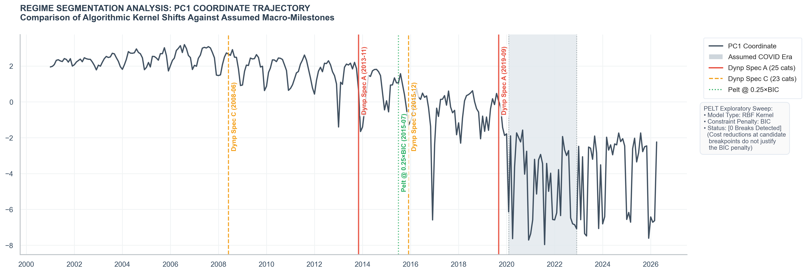

# Chicago Crime Composition Analysis (2001–2026)

> Testing whether Chicago's crime composition broke at COVID, or whether the changes that look like a COVID shock were already underway.



## Abstract

Many cities responded to COVID-era crime trends by reorganizing policing budgets and policies on the assumption that the pandemic caused a discrete break in how crime occurred. Using 25+ years of Chicago crime data (Jan 2001–Apr 2026; 304 months, ~8.5 million reported incidents across 25 FBI categories), this project tests that assumption: did Chicago's crime composition, the mix of crime types reported each month, actually shift during the pandemic, or were the changes that look like a COVID shock already underway?

The data shows the latter. Four independent statistical methods all point to gradual compositional evolution rather than a discrete pandemic-era regime shift. The largest post-pandemic changes trace to the multi-year decline of drug-enforcement categories, not to the pandemic itself.

## Key Findings

- **No detected regime break at COVID.** Pelt changepoint detection with BIC penalty returns zero breakpoints across penalty multipliers from 0.5× to 4× BIC, and across minimum-segment-length choices from 12 to 36 months. The pandemic period does not register as a structural shift in the multivariate compositional system.

- **The largest post-2020 changes are tail-of-trend, not shock.** Drug Abuse Violations declined steadily from a 2008 peak; the post-COVID share is the continuation of a 15-year trajectory. Liquor Laws broke structurally in 2015, five years before COVID. Only three of the 24 dense categories show a clean single-break point under Zivot-Andrews testing.

- **The dependence structure between crime types shifted across eras, but the mechanism is compositional, not behavioral.** Drug Abuse Violations and Liquor Laws are both high-share, declining categories that drive most of the cross-era correlation shifts. As they shrank, the negative correlations they mechanically imposed on other categories' shares weakened. This is compositional pressure release, not the formation of new criminal patterns.

## Methods Used

- **Centered Log-Ratio (CLR) transformation** with grid-searched pseudocount selection and adjacent-value sensitivity check
- **Three-way sensitivity structure** (unscaled vs z-scored; full vs vice-excluded) following Aitchison's compositional framework
- **Principal Component Analysis** on the pooled 304-month panel
- **Per-era covariance estimation** with Ledoit-Wolf shrinkage (essential for the small COVID-era sample)
- **Stationarity testing** (ADF, KPSS, Zivot-Andrews) with FDR correction across 24 dense categories (of 25 total categories; one rare/other category excluded from dense-category analyses)
- **Block bootstrap** (6-month blocks, 10,000 iterations) for era-pair mean comparison
- **Multivariate changepoint detection**: Dynp (confirmatory, forced n=2) and Pelt (exploratory, BIC penalty sweep with dimensionality-scaled penalties)
- **Frobenius-distance comparison** of per-era LW-shrunk correlation matrices, with two within-era baselines (halves and short-window resampling)
- **Element-wise correlation differences** to identify the specific category-pairs driving cross-era dependence shifts

## What I Learned

**Following the data when it contradicts the framing.** My initial scope statement asked "where are the structural breaks during COVID?" assuming the data would identify break dates near the pandemic boundaries. The changepoint analysis rejected that framing. Pelt found zero breaks under conventional BIC penalties, and Dynp's forced breaks landed years before COVID. I rewrote the scope to test the assumption rather than confirm it, and rewrote the conclusion to deliver the negative result clearly. This cost a few revision cycles but is the right move; portfolios that find what they expected to find are less interesting than portfolios that let the data overturn the framing.

**Documenting data quality issues rather than working around them.** The companion visualization notebook surfaced a Ward field artifact: ~694K incidents tagged to Ward 50 turned out to be an ETL-pipeline missing-data sentinel, not a real ward attribution. Filtering would have removed both the bad rows and ~91K legitimate West Ridge incidents that couldn't be separated. Rather than present ward-level findings derived from contaminated data, I omitted the Ward section with a clear note explaining what was found and why the omission was the right call. Documenting why a section *isn't* there is better than presenting fragile numbers; in industry roles, knowing when not to ship is a load-bearing skill.

**Sample-size discipline on multivariate methods.** Per-era PCA would have been a natural extension, but the COVID era has 34 months against 25 dimensions which is well below the 5d–10d threshold for stable eigenvector estimation. I used Frobenius distance and element-wise correlation differences as descriptive alternatives that don't require eigenvector stability, and explicitly noted in the writeup why per-era PCA was not attempted. Choosing the right tool for the data scale is a judgment call that's easier to get wrong than right.

## Limitations

- **Reporting lag** — The Chicago Data Portal backfills recent months. April 2026 data is partly affected; the post-COVID tail should be interpreted with this in mind.
- **Enforcement vs. occurrence** — Reported counts measure police activity, not crime occurrence. For enforcement-driven categories (drug abuse, vice, weapons, liquor laws), counts reflect enforcement priorities. Because CLR shares are compositionally coupled, shifts in enforcement of high-share categories propagate to every other category's share statistics.
- **Compositional vs. absolute** — All findings describe changes in *relative* crime composition, not changes in absolute incident counts.
- **Ward analysis omitted** — The Ward field contained an ETL sentinel (many incidents tagged to Ward 50). See the notebook diagnostics in `notebook/ChicagoCrimeDetection.ipynb` for details on the Ward 50 artifact and why the Ward section was removed.

## What I'd Do Next

- **Multi-city comparison.** Replicating this analysis on Los Angeles or New York would test whether Chicago's gradual-evolution finding generalizes or is city-specific.
- **Out-of-sample validation.** Training the dependence-structure model on pre-2020 data and projecting onto post-2020 months would quantify how anomalous the pandemic period is under a pre-pandemic baseline.
- **Generative model.** A Hidden Markov Model on the CLR series would let the data speak to whether discrete states exist (predicted answer based on the current null: no, but worth confirming).

## Repository Structure

```
ChicagoCrimeCompositionAnalysis/
├── README.md                              # this file
├── requirements.txt                        # Python dependencies for the project
├── data/
│   └── crime_data.feather                 # primary dataset (feather format)
├── figures/
│   └── regime_segmentation.png            # headline figure (also embedded in this README)
├── modules/
│   ├── clr_analyze_plot.py                # analysis & plotting helpers
│   ├── clr_config.py                      # era boundaries, constants, config
│   ├── clr_eps_grid.py                    # epsilon grid generation & sweep
│   ├── clr_era.py                         # era slicing, distribution & PCA workflows
│   ├── clr_pca_sign_normalization.py      # PCA sign-normalization helpers
│   └── clr_utilities.py                   # data aggregation, panel filling, integrity checks
└── notebook/
    └── ChicagoCrimeDetection.ipynb        # main analytical notebook
```

## Quickstart

Setup a Python environment, install dependencies, and open the notebook:

```bash
# from project root
python3 -m venv .venv
source .venv/bin/activate
pip install --upgrade pip
pip install -r requirements.txt
# start the notebook server (open the interface, then open the notebook file)
jupyter notebook
# or, start JupyterLab
jupyter lab
```

Notes:

- The project expects the primary dataset at `data/crime_data.feather`.
- The notebook appends `../modules/` to `sys.path` to import the `clr_*.py` helpers.

## Usage

- Run the notebook cells in order. The top cells handle imports and data loading.
- If your editor flags `import clr_config as cfg` with a linter warning, ensure
    the workspace Python interpreter matches the environment used to install
    `requirements.txt`, or add `./modules` to your Python analysis paths.
